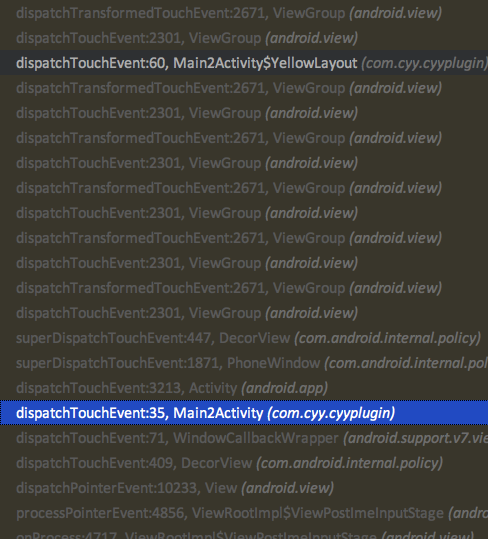

带着几个问题去研究一下android的事件分发原理，这里只研究事件的分发机制

1.activity和View树的事件关系和View树的事件是从什么地方开始分发的？
2.android是怎么将事件分发给对应的View上的？

##### activity和View树的事件关系？
```
public boolean dispatchTouchEvent(MotionEvent ev) {
    if (ev.getAction() == MotionEvent.ACTION_DOWN) {
        onUserInteraction();
    }
    if (getWindow().superDispatchTouchEvent(ev)) {
        return true;
    }
    return onTouchEvent(ev);
}
```
这个dispatchTouchEvent是activity实现Window的Callback接口的方法，这个是事件的入口处，activity最先接到系统的事件。
调用getWindow().superDispatchTouchEvent(ev)将事件传给Window。而android的Window的实现类其实就是PhoneWindow，
这行代码实际上就是调用PhoneWindow.superDispatchTouchEvent(ev)
```
@Override
public boolean superDispatchTouchEvent(MotionEvent event) {
    return mDecor.superDispatchTouchEvent(event);
}
```
PhoneWindow直接调用DecorView.superDispatchTouchEvent(event)。事件开始进入View树
```
@Override
public boolean dispatchTouchEvent(MotionEvent ev) {
    final Window.Callback cb = mWindow.getCallback();
    return cb != null && !mWindow.isDestroyed() && mFeatureId < 0
            ? cb.dispatchTouchEvent(ev) : super.dispatchTouchEvent(ev);
}
```

debug的堆栈调用循序



###### android是怎么将事件分发给对应的View上的？

android 的事件分发的核心代码在ViewGroup.dispatchTouchEvent(ev),该方法重写了View的dispatchTouchEvent

view的dispatchTouchEvent
```
public boolean dispatchTouchEvent(MotionEvent event) {
    // If the event should be handled by accessibility focus first.
    if (event.isTargetAccessibilityFocus()) {
        // We don't have focus or no virtual descendant has it, do not handle the event.
        if (!isAccessibilityFocusedViewOrHost()) {
            return false;
        }
        // We have focus and got the event, then use normal event dispatch.
        event.setTargetAccessibilityFocus(false);
    }

    boolean result = false;

    if (mInputEventConsistencyVerifier != null) {
        mInputEventConsistencyVerifier.onTouchEvent(event, 0);
    }

    final int actionMasked = event.getActionMasked();
    if (actionMasked == MotionEvent.ACTION_DOWN) {
        // Defensive cleanup for new gesture
        stopNestedScroll();
    }

    if (onFilterTouchEventForSecurity(event)) {
        if ((mViewFlags & ENABLED_MASK) == ENABLED && handleScrollBarDragging(event)) {
            result = true;
        }
        //noinspection SimplifiableIfStatement
        ListenerInfo li = mListenerInfo;
        if (li != null && li.mOnTouchListener != null
                && (mViewFlags & ENABLED_MASK) == ENABLED
                && li.mOnTouchListener.onTouch(this, event)) {
            result = true;
        }

        if (!result && onTouchEvent(event)) {
            result = true;
        }
    }

    if (!result && mInputEventConsistencyVerifier != null) {
        mInputEventConsistencyVerifier.onUnhandledEvent(event, 0);
    }

    // Clean up after nested scrolls if this is the end of a gesture;
    // also cancel it if we tried an ACTION_DOWN but we didn't want the rest
    // of the gesture.
    if (actionMasked == MotionEvent.ACTION_UP ||
            actionMasked == MotionEvent.ACTION_CANCEL ||
            (actionMasked == MotionEvent.ACTION_DOWN && !result)) {
        stopNestedScroll();
    }

    return result;
}
```

这个方法比较简单，去掉处理内部滑动的部分，改代码主要是将事件分发给自己的mOnTouchListener和onTouchEvent
记住View.dispatchTouchEvent(ev)是将事件分发给自己的

接下来是ViewGroup的dispatchTouchEvent
```
public boolean dispatchTouchEvent(MotionEvent ev) {
    if (mInputEventConsistencyVerifier != null) {
        mInputEventConsistencyVerifier.onTouchEvent(ev, 1);
    }

    // If the event targets the accessibility focused view and this is it, start
    // normal event dispatch. Maybe a descendant is what will handle the click.
    if (ev.isTargetAccessibilityFocus() && isAccessibilityFocusedViewOrHost()) {
        ev.setTargetAccessibilityFocus(false);
    }

    boolean handled = false;
    if (onFilterTouchEventForSecurity(ev)) {
        final int action = ev.getAction();
        final int actionMasked = action & MotionEvent.ACTION_MASK;

        // Handle an initial down.
        if (actionMasked == MotionEvent.ACTION_DOWN) {
            // Throw away all previous state when starting a new touch gesture.
            // The framework may have dropped the up or cancel event for the previous gesture
            // due to an app switch, ANR, or some other state change.
            cancelAndClearTouchTargets(ev);
            resetTouchState();
        }

        // Check for interception.
        final boolean intercepted;
        if (actionMasked == MotionEvent.ACTION_DOWN
                || mFirstTouchTarget != null) {
            final boolean disallowIntercept = (mGroupFlags & FLAG_DISALLOW_INTERCEPT) != 0;
            if (!disallowIntercept) {
                intercepted = onInterceptTouchEvent(ev);
                ev.setAction(action); // restore action in case it was changed
            } else {
                intercepted = false;
            }
        } else {
            // There are no touch targets and this action is not an initial down
            // so this view group continues to intercept touches.
            intercepted = true;
        }

        // If intercepted, start normal event dispatch. Also if there is already
        // a view that is handling the gesture, do normal event dispatch.
        if (intercepted || mFirstTouchTarget != null) {
            ev.setTargetAccessibilityFocus(false);
        }

        // Check for cancelation.
        final boolean canceled = resetCancelNextUpFlag(this)
                || actionMasked == MotionEvent.ACTION_CANCEL;

        // Update list of touch targets for pointer down, if needed.
        final boolean split = (mGroupFlags & FLAG_SPLIT_MOTION_EVENTS) != 0;
        TouchTarget newTouchTarget = null;
        boolean alreadyDispatchedToNewTouchTarget = false;
        if (!canceled && !intercepted) {

            // If the event is targeting accessiiblity focus we give it to the
            // view that has accessibility focus and if it does not handle it
            // we clear the flag and dispatch the event to all children as usual.
            // We are looking up the accessibility focused host to avoid keeping
            // state since these events are very rare.
            View childWithAccessibilityFocus = ev.isTargetAccessibilityFocus()
                    ? findChildWithAccessibilityFocus() : null;

            if (actionMasked == MotionEvent.ACTION_DOWN
                    || (split && actionMasked == MotionEvent.ACTION_POINTER_DOWN)
                    || actionMasked == MotionEvent.ACTION_HOVER_MOVE) {
                final int actionIndex = ev.getActionIndex(); // always 0 for down
                final int idBitsToAssign = split ? 1 << ev.getPointerId(actionIndex)
                        : TouchTarget.ALL_POINTER_IDS;

                // Clean up earlier touch targets for this pointer id in case they
                // have become out of sync.
                removePointersFromTouchTargets(idBitsToAssign);

                final int childrenCount = mChildrenCount;
                if (newTouchTarget == null && childrenCount != 0) {
                    final float x = ev.getX(actionIndex);
                    final float y = ev.getY(actionIndex);
                    // Find a child that can receive the event.
                    // Scan children from front to back.
                    final ArrayList<View> preorderedList = buildTouchDispatchChildList();
                    final boolean customOrder = preorderedList == null
                            && isChildrenDrawingOrderEnabled();
                    final View[] children = mChildren;
                    for (int i = childrenCount - 1; i >= 0; i--) {
                        final int childIndex = getAndVerifyPreorderedIndex(
                                childrenCount, i, customOrder);
                        final View child = getAndVerifyPreorderedView(
                                preorderedList, children, childIndex);

                        // If there is a view that has accessibility focus we want it
                        // to get the event first and if not handled we will perform a
                        // normal dispatch. We may do a double iteration but this is
                        // safer given the timeframe.
                        if (childWithAccessibilityFocus != null) {
                            if (childWithAccessibilityFocus != child) {
                                continue;
                            }
                            childWithAccessibilityFocus = null;
                            i = childrenCount - 1;
                        }

                        if (!canViewReceivePointerEvents(child)
                                || !isTransformedTouchPointInView(x, y, child, null)) {
                            ev.setTargetAccessibilityFocus(false);
                            continue;
                        }

                        newTouchTarget = getTouchTarget(child);
                        if (newTouchTarget != null) {
                            // Child is already receiving touch within its bounds.
                            // Give it the new pointer in addition to the ones it is handling.
                            newTouchTarget.pointerIdBits |= idBitsToAssign;
                            break;
                        }

                        resetCancelNextUpFlag(child);
                        if (dispatchTransformedTouchEvent(ev, false, child, idBitsToAssign)) {
                            // Child wants to receive touch within its bounds.
                            mLastTouchDownTime = ev.getDownTime();
                            if (preorderedList != null) {
                                // childIndex points into presorted list, find original index
                                for (int j = 0; j < childrenCount; j++) {
                                    if (children[childIndex] == mChildren[j]) {
                                        mLastTouchDownIndex = j;
                                        break;
                                    }
                                }
                            } else {
                                mLastTouchDownIndex = childIndex;
                            }
                            mLastTouchDownX = ev.getX();
                            mLastTouchDownY = ev.getY();
                            newTouchTarget = addTouchTarget(child, idBitsToAssign);
                            alreadyDispatchedToNewTouchTarget = true;
                            break;
                        }

                        // The accessibility focus didn't handle the event, so clear
                        // the flag and do a normal dispatch to all children.
                        ev.setTargetAccessibilityFocus(false);
                    }
                    if (preorderedList != null) preorderedList.clear();
                }

                if (newTouchTarget == null && mFirstTouchTarget != null) {
                    // Did not find a child to receive the event.
                    // Assign the pointer to the least recently added target.
                    newTouchTarget = mFirstTouchTarget;
                    while (newTouchTarget.next != null) {
                        newTouchTarget = newTouchTarget.next;
                    }
                    newTouchTarget.pointerIdBits |= idBitsToAssign;
                }
            }
        }

        // Dispatch to touch targets.
        if (mFirstTouchTarget == null) {
            // No touch targets so treat this as an ordinary view.
            handled = dispatchTransformedTouchEvent(ev, canceled, null,
                    TouchTarget.ALL_POINTER_IDS);
        } else {
            // Dispatch to touch targets, excluding the new touch target if we already
            // dispatched to it.  Cancel touch targets if necessary.
            TouchTarget predecessor = null;
            TouchTarget target = mFirstTouchTarget;
            while (target != null) {
                final TouchTarget next = target.next;
                if (alreadyDispatchedToNewTouchTarget && target == newTouchTarget) {
                    handled = true;
                } else {
                    final boolean cancelChild = resetCancelNextUpFlag(target.child)
                            || intercepted;
                    if (dispatchTransformedTouchEvent(ev, cancelChild,
                            target.child, target.pointerIdBits)) {
                        handled = true;
                    }
                    if (cancelChild) {
                        if (predecessor == null) {
                            mFirstTouchTarget = next;
                        } else {
                            predecessor.next = next;
                        }
                        target.recycle();
                        target = next;
                        continue;
                    }
                }
                predecessor = target;
                target = next;
            }
        }

        // Update list of touch targets for pointer up or cancel, if needed.
        if (canceled
                || actionMasked == MotionEvent.ACTION_UP
                || actionMasked == MotionEvent.ACTION_HOVER_MOVE) {
            resetTouchState();
        } else if (split && actionMasked == MotionEvent.ACTION_POINTER_UP) {
            final int actionIndex = ev.getActionIndex();
            final int idBitsToRemove = 1 << ev.getPointerId(actionIndex);
            removePointersFromTouchTargets(idBitsToRemove);
        }
    }

    if (!handled && mInputEventConsistencyVerifier != null) {
        mInputEventConsistencyVerifier.onUnhandledEvent(ev, 1);
    }
    return handled;
}
```

这段代码可以说的上是非常的复杂，但是系统的有注释，看着注释可以明白一二。我是从SDK26复制的，不同的SDK代码可能不一样，但是总体差不多。
主要用一下几点总结这个方法

##### 1. 通过onFilterTouchEventForSecurity判断当前View是不是被遮挡住
##### 2. 判断是否拦截该次事件。如果拦截intercepted＝true 不拦截intercepted=false。
 拦截的判断条件是
1.如果是为down事件,mFirstTouchTarget有值，就会拦截，会走onInterceptTouchEvent方法（这里前提是设置允许事件拦截）。mFirstTouchTarget会在down事件的时候就会由这个方法来确定是他的哪一个Child
来接收事件，mFirstTouchTarget就是接收事件的Child的一个缓存类，mFirstTouchTarget持有接收事件的Child。

2.如果没有Child，mFirstTouchTarget等于null，就会直接将intercepted设置为true，同时不回走onInterceptTouchEvent方法。

3.mFirstTouchTarget等于null，不回拦截。

##### 3.从child当中寻找TouchTarget
1.if (!canceled && !intercepted)这个块中整个就是寻找接收事件的Child的，然后给mFirstTouchTarget赋值。

2.dispatchTransformedTouchEvent(MotionEvent event, boolean cancel,View child, int desiredPointerIdBits) 这个方法负责将事件分发下去。
在这时第三个参数child就是要接受事件的子view，最终掉用child的dispatchTouchEvent()，这个方法要求一个返回值handle，
而这个handle的返回值取决于child的dispatchTouchEvent()。假设child的dispatchTouchEvent()返回的是true，就会执行if中的语句，
这里是确定了child要处理该次事件，并给mFirstTouchTarget赋值，接下来MOVE事件也会因为mFirstTouchTarget会继续分发给这个View。
child的dispatchTouchEvent()返回的是false,在第一次分发给这个Child后，没有给mFirstTouchTarget赋值，接下来因为mFirstTouchTarget=null,
没有消费事件的对象，不会在分发下去。

##### 4.真正开始分发事件
前面都是为了找到mFirstTouchTarget，根据mFirstTouchTarget是否有值，决定分发给自己还是Child

